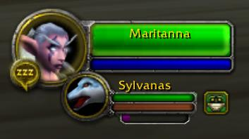

# Pet XP Bar
A World of Warcraft: Vanilla addon that displays experience bar of a hunter's active pet in the default Blizzard pet frame.

### Acknowledgements
- [PetXPBarPlus](https://github.com/DustinChecketts/PetXPBarPlus) by [DustinChecketts](https://github.com/DustinChecketts)
- [RestBar](https://github.com/Steelbash/RestBar) by [Steelbash](https://github.com/Steelbash)
- [Blizzard UI Source Code](https://github.com/MOUZU/Blizzard-WoW-Interface/tree/master/1.12.1)
